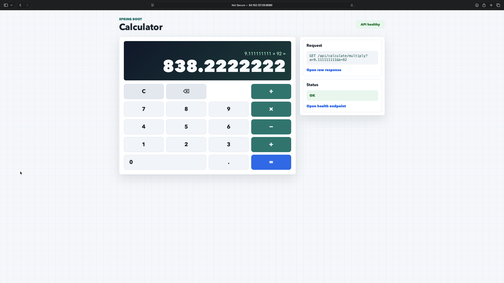

# Calculator App

A REST calculator built with **Spring Boot 3.2** and **Java 21**, containerized with Docker, and deployed to AWS EC2 via a fully automated CI/CD pipeline powered by GitHub Actions and Terraform.

---

## Screenshot



---

## Quick Start

```bash
# Run locally (port 8090 by default)
task run

# Then open
open http://localhost:8090
```

> Requires Java 21+ and [Task](https://taskfile.dev). See [Prerequisites](#prerequisites) below.

---

## API

| Method | Path                      | Params   | Response               |
| ------ | ------------------------- | -------- | ---------------------- |
| GET    | `/`                       | —        | Browser calculator UI  |
| GET    | `/api/calculate/add`      | `a`, `b` | `{"result": 7.0}`      |
| GET    | `/api/calculate/subtract` | `a`, `b` | `{"result": 1.0}`      |
| GET    | `/api/calculate/multiply` | `a`, `b` | `{"result": 12.0}`     |
| GET    | `/api/calculate/divide`   | `a`, `b` | `{"result": 2.5}`      |
| GET    | `/actuator/health`        | —        | `{"status": "UP"}`     |

`/divide` returns HTTP 400 with `{"error": "Division by zero"}` when `b=0`.

---

## CI/CD Pipeline

Every push to `main` runs three sequential jobs:

```
test → build-and-push → deploy
        (main only)     (main only)
```

| Job              | Trigger           | What it does                                            |
| ---------------- | ----------------- | ------------------------------------------------------- |
| `test`           | all pushes & PRs  | Runs `task check`: lint + unit tests + Terraform validate |
| `build-and-push` | push to `main`    | Builds multi-arch Docker image, pushes to Docker Hub    |
| `deploy`         | push to `main`    | Deploys to EC2 via AWS SSM Session Manager (no SSH)     |

### GitHub Secrets

Go to **Settings → Secrets and variables → Actions** and add:

| Secret                  | Value                               |
| ----------------------- | ----------------------------------- |
| `DOCKERHUB_USERNAME`    | Your Docker Hub username            |
| `DOCKERHUB_TOKEN`       | Docker Hub access token             |
| `AWS_ACCESS_KEY_ID`     | AWS IAM access key                  |
| `AWS_SECRET_ACCESS_KEY` | AWS IAM secret key                  |

---

## Infrastructure (Terraform)

Terraform provisions a minimal, free-tier AWS setup:

- VPC + public subnet + internet gateway
- Security group: inbound on port 8080 only (no port 22)
- EC2 `t2.micro` (Ubuntu 22.04 LTS, AMI resolved dynamically)
- IAM instance profile with SSM permissions for remote access
- `user_data` bootstraps Docker and starts the container on first boot

Remote access is via **AWS SSM Session Manager** — no SSH keys anywhere.

### First-time deploy

```bash
# 1. Set AWS credentials
export AWS_ACCESS_KEY_ID=...
export AWS_SECRET_ACCESS_KEY=...

# 2. Copy and fill in variables
cp terraform/terraform.tfvars.example terraform/terraform.tfvars
# Set docker_image = "yourdockerhubuser/calculator-app:latest"

# 3. Provision
task tf:init
task tf:apply

# 4. Get the app URL
task tf:output -- app_url
```

> After `apply`, wait ~60 s for the EC2 user data script to finish.

### Tear down

```bash
task tf:destroy
```

---

## Run with Docker

```bash
# Build
task docker:build

# Run
task docker:run

# Open
open http://localhost:8080
```

---

## All task commands

```bash
task              # list everything
task check        # lint + test + terraform validate (what CI runs)
task test         # unit tests only
task run          # Spring Boot dev server
task package      # build JAR
task docker:build # build Docker image
task docker:run   # run Docker image
task tf:init      # terraform init
task tf:plan      # terraform plan
task tf:apply     # terraform apply
task tf:destroy   # terraform destroy
task tf:output    # show terraform outputs
```

---

## Project Structure

```
calculator-app/
├── .github/workflows/ci-cd.yml    # GitHub Actions pipeline
├── src/
│   ├── main/java/com/example/calculator/
│   │   ├── CalculatorApplication.java
│   │   ├── controller/CalculatorController.java  # REST layer
│   │   └── service/CalculatorService.java        # Business logic
│   ├── main/resources/
│   │   ├── application.properties
│   │   └── static/                # Browser UI (HTML + CSS + JS)
│   └── test/java/.../service/
│       └── CalculatorServiceTest.java
├── terraform/
│   ├── main.tf                    # VPC, subnet, IGW, SG, EC2, IAM
│   ├── variables.tf
│   ├── outputs.tf
│   ├── user_data.sh.tpl           # EC2 bootstrap script
│   └── terraform.tfvars.example
├── docs/
│   └── screenshot.png
├── Dockerfile                     # Multi-stage: JDK builder → JRE runtime
├── Taskfile.yml                   # All CLI automation
└── pom.xml
```

---

## Prerequisites

| Tool      | macOS                            | Windows                    |
| --------- | -------------------------------- | -------------------------- |
| Java 21+  | `brew install --cask temurin@21` | [adoptium.net](https://adoptium.net) |
| Task      | `brew install go-task`           | `winget install Task.Task` |
| Docker    | [Docker Desktop](https://www.docker.com/products/docker-desktop/) | [Docker Desktop](https://www.docker.com/products/docker-desktop/) |
| Terraform | `brew install terraform`         | `choco install terraform`  |
| AWS CLI   | `brew install awscli`            | `choco install awscli`     |
| GitHub CLI| `brew install gh`                | `choco install gh`         |
